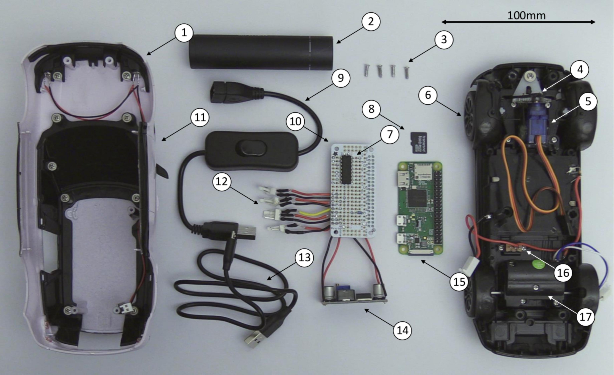

# Making a minicar

### Exploded view of a minicar

1. Headlights
2. Portable charger
3. Casing screws
4.Gear
5. Servo
6. Lower casing
7. H-bridge
8. Micro SD card
9. USB switch
10. Circuit board
11. Upper casing
12. JST connectors
13. Micro USB cable
14. Boost converter
15. Raspberry Pi Zero W
16. Motor switch
17. Drive motor

### Components
* [Car]()
* [3x Eneloop Pro AA batteries]()
* [Raspberry Pi Zero W]()
* [8GB SD card]()
* [Micro servo motor]()
* [Gear](gear.pdf)
* [Proto Bonnet]()
* [XL6009 boost converter]()
* [L293D]()
* [3x Female 2 way JST connectors]()
* [3x Male 2 way JST connectors](https://uk.rs-online.com/web/p/pcb-headers/4838461/)
* [Male 3 way]()
* [6x crimp]()
* Wire
* Solder

### Tools
* Crosshead screwdriver
* Flathead screwdriver
* Plier cutters
* Wire stripper
* Crimping tool
* File
* Multimeter
* Soldering iron
